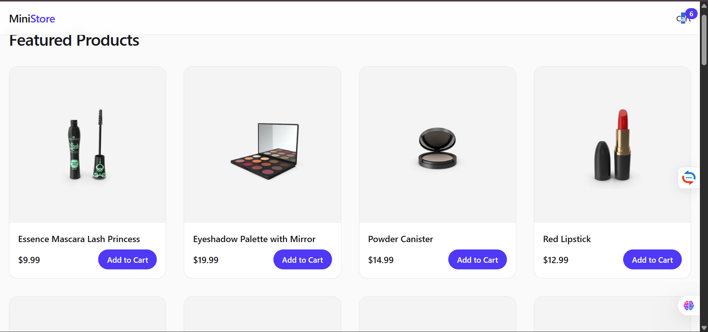
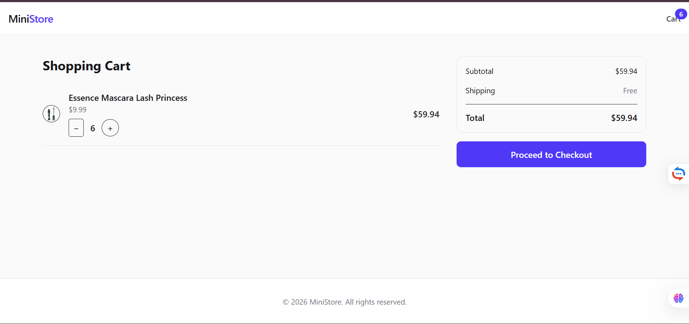
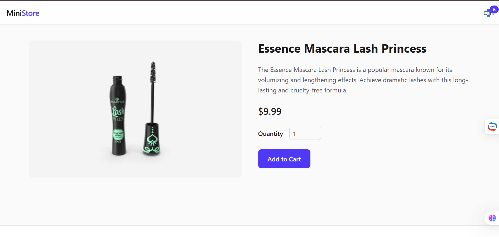

# 🛒 Mini E-Commerce Storefront

A portfolio-grade mini e-commerce application built as part of **Future Interns – Full Stack Web Development Task 2**.

This project demonstrates real-world frontend architecture, state management, and clean UI/UX practices expected in modern startups.

---

## 🚀 Live Demo

👉 https://future-fs-02-vert.vercel.app/

---

## ✨ Features

- Product listing with responsive grid
- Product detail pages with quantity selection
- Shopping cart with:
  - Add / remove items
  - Update quantity
  - Live price calculation
- Checkout flow with form validation
- Order confirmation screen
- Fully responsive (mobile & desktop)

---

## 🛠 Tech Stack

- **Frontend**: React.js (Vite)
- **Styling**: Tailwind CSS
- **State Management**: Zustand
- **Routing**: React Router
- **Data Source**: DummyJSON API
- **Deployment**: Vercel

---

## 🧠 Architecture Highlights

- Scalable folder structure
- Separation of UI, pages, and global state
- Derived state for totals (no duplication)
- Clean component boundaries
- Backend-ready architecture

---

## 📸 Screenshots





---

## 📦 Installation & Setup

```bash
git clone https://github.com/18mukeshram/FUTURE_FS_02
cd FUTURE_FS_02
npm install
npm run dev
📌 Notes
Payments are simulated (no real transactions).

The project is designed to be easily extended with authentication and backend services.

## 👤 Author
Bellamkonda Sai Mukesh Ram

GitHub: https://github.com/18mukeshram

Portfolio: https://mukesh-portfolio-main.vercel.app

LinkedIn: https://linkedin.com/in/bellamkonda-sai-mukesh-ram-60619731b
```
